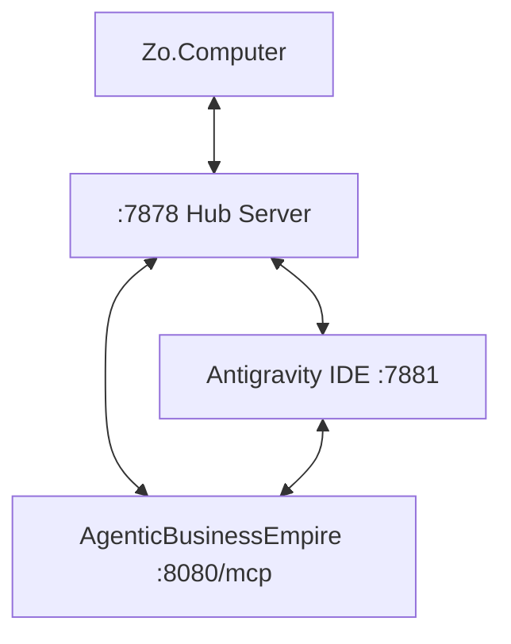

# Zo ↔ Antigravity ↔ AgenticBusinessEmpire 3-Way MCP Mesh

This is a premium, symmetric, 3-node **Model Context Protocol (MCP) mesh** connecting Zo.Computer, Antigravity IDE, and AgenticBusinessEmpire into a unified autonomous workspace.

## Architecture

A true peer-to-peer agent mesh where every node acts as both an **MCP Server** (tools) and **MCP Client** (calling peers).



## Quick Start (3-Way Mesh)

1. **Install dependencies**:
   ```bash
   ./scripts/install.sh
   ```

2. **Launch the Mesh**:
   ```bash
   python3 main.py mesh
   ```
   *Starts Hub (:7878), IDE Server (:7881), and Dashboard (:7880).*

3. **Connect peers**:
   - **Zo**: Add integration using `mcp_config_zo.json`.
   - **Antigravity**: Configure using `mcp_config_antigravity.json`.
   - **AgenticBusinessEmpire**: Register via `register_peer` tool using `mcp_config_agenticbusinessempire.json`.

## Shared Actions Log

Every action taken by any agent is logged as a JSONL entry in `shared/actions.log`. This provides a unified, cross-agent audit trail:
- **Human-readable**: One JSON object per line.
- **Queryable**: Use the `get_actions_log` MCP tool.
- **Viewable**: Real-time monitoring in the dashboard's **Actions Log** tab.

## Security

* **Mutual API Key Auth**: All peer-to-peer calls are validated with HMAC-SHA256.
* **Encrypted Secrets**: Agent secrets are stored in `.vault/` using AES-256-GCM.
* **Session Sync**: Real-time IDE context (files, cursor, debugger) shared between all nodes.

## Bundled Extensions

| ID | Description | Enabled |
|----|--------------|---------|
| `code-mirror` | Live code editing sync | ✅ |
| `shell-relay` | Cross-agent shell execution | ✅ |
| `context-bridge` | Conversational context sharing | ✅ |
| `web-preview` | Shared browser/app preview | ❌ |

## Dashboard

Live monitoring at `http://localhost:7880` featuring 8 tabs:
`Events` · `Workspace` · `Commands` · `Features` · `Secrets` · `Extensions` · `Messages` · `Actions Log`
